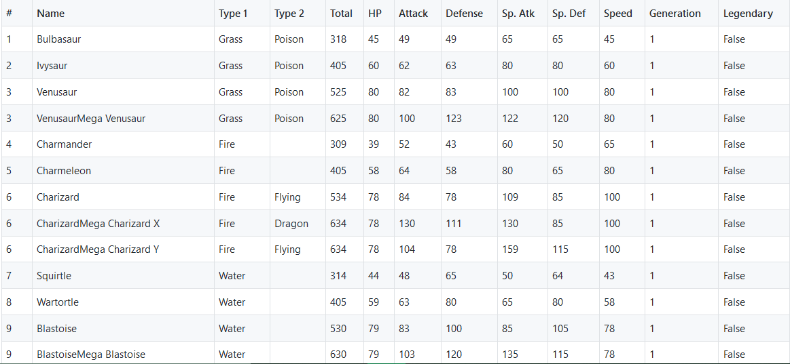

# Seaborn---Pokemon-Analysis

Bulbasaur,Squirtle,Charmander or Pikachu.
#### Have you ever wondered who's stronger of these all?

 

### We have all watched Pokemon as kids.

Now that we're onto Data Science,let's analyze who's stronger not just among these 4 but out of all the 151 pokemon from the ***Pokemon.csv*** dataset.

Dataset source : <https://gist.github.com/armgilles/194bcff35001e7eb53a2a8b441e8b2c6>

### Here's a look at the dataset :

## This is a visually focussed analysis using Seaborn's powerful plots to describe and analyze the data.

### Seaborn reference : <https://seaborn.pydata.org/>

Idea : elitedatascience.com